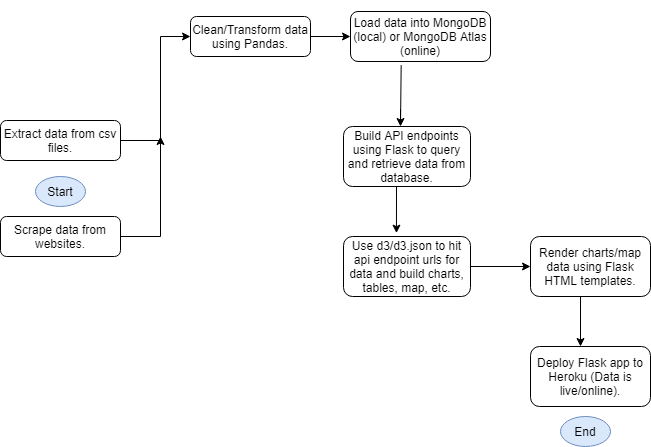

# Australia API and Dashboard

## Background

This project explores how wildfires have affected the country of Australia over time. Specifically, for this project, we gathered data captured by NASA satellites and various historical wildfire and climate data to help visualize what Australia not only has been through historically but also what Australia has gone through with the most recent (2019-2020) wildfire season. Go to our [website](https://australia-fire-api-dashboard.herokuapp.com/) to learn more about this project.

## Loading data into a database

The data for this project is stored in a MongoDB database.

For more information on where this data came from, see the [Data](https://australia-fire-api-dashboard.herokuapp.com/data) page of the site.

To load the data into a local database, perform these steps:

1. [Install MongoDB](https://docs.mongodb.com/manual/administration/install-community/)
2. Start MongoDB locally by running `mongod` from the terminal.
3. Open the [etl_fires_from_space.ipynb](./etl_fires_from_space.ipynb) jupyter notebook file and run the cells to extract, transform, and load the data.
4. Open the [WebScrapping.ipynb](./WebScraping.ipynb) jupyter notebook file and run the cells to scrape and load the data.
5. Open the [temp_rainfall.ipynb](./temp_rainfall.ipynb) jupyter notebook file and run the cells to extract, transform, and load the data.
6. Verify the data is inserted by opening MongoDB Compass and looking for the **australia_fire_db** database.

## Data Structure

The **australia_fire_db** currently has the following collections:

- **fires_modis** - includes australia fires detected by MODIS (Moderate Resolution Imaging Spectroradiometer) satellite sensors.

| Field       | Type
| :------------- | :----------: |
|  `_id` | ObjectId |
| `acq_date`   | String |
|  `acq_time` | Int |
| `bright_t31` | Double |
| `brightness` | Double |
| `daynight` | String |
| `frp` | Double |
| `instrument` | String |
| `latitude` | Double |
| `longitude` | Double |
| `satellite` | String |

- **fires_viirs** - includes australia fires detected by VIIRS (Visible Infrared Imaging Radiometer Suite) satellite sensors.

| Field       | Type
| :------------- | :----------: |
|  `_id` | ObjectId |
| `acq_date`   | String |
|  `acq_time` | Int |
| `bright_ti4` | Double |
| `bright_ti5` | Double |
| `frp` | Double |
| `instrument` | String |
| `latitude` | Double |
| `longitude` | Double |
| `satellite` | String |

- **historicalFires** - includes information about past Australia fire seasons.

| Field       | Type
| :------------- | :----------: |
|  `_id` | ObjectId |
| `Date`   | String |
|  `Name` | String |
| `State(s)/territories` | String |
| `AreaBurned(ha)` | Int |
| `AreaBurned(acres)` | Int |
| `Fatalities` | Int |
| `PropertiesDamaged(HomesDestroyed)` | Int |
| `Year` | Int |

- **temp_rainfall** - includes Australian average annual max temperatures and rainfall from 1956-2019.

| Field       | Type
| :------------- | :----------: |
|  `_id` | ObjectId |
| `Year`   | Int |
|  `Avg Annual Temp` | Double|
| `Avg Annual Rainfall` | Double |
| `temp_differnce` | Double |
| `rainfall_difference` | Double |

- **bushfiresbyState** - includes information about the 2019-2020 bushfire season by state.

| Field       | Type
| :------------- | :----------: |
|  `_id` | ObjectId |
| `State/Territory`   | String |
|  `Fatalities` | Int |
| `Homeslost` | Int |
| `Areaestimated(ha)` | Int |
| `Areaestimated(acres)` | Int |

- **aus2019_2020** - includes additional information about the 2019-2020 bushfire season.

| Field       | Type
| :------------- | :----------: |
|  `_id` | ObjectId |
| `Fire`   | String |
|  `Name` | String |
| `State` | String |
| `Local Government Area(s)` | String |
| `AreaImpacted(ha)` | Int |

- **fires_time_series** - includes the number of fires captured by NASA satellites each day
during the 2019-20 Australia fire season. This collection is used to create the D3 time series chart for this project.

| Field       | Type
| :------------- | :----------: |
|  `_id` | ObjectId |
| `acq_date`   | String |
|  `number_fires` | Int |

## Data Flow



## Technologies Used

- D3
- [d3-timeseries](https://github.com/mcaule/d3-timeseries) for building the time series chart (new JavaScript library used for this project)
- MongoDB (for storing the data locally) and MongoDB Atlas (for storing the data in the cloud).
- Leaflet
- Heroku
- Python
- Pandas
- Beautiful Soup

## Original Datasets

The original datasets/csv files are stored in this repository as zip files in the [Resources](./Resources) folder.

This repo uses Git LFS to store the large dataset files on GitHub. To install Git LFS, go [here](https://git-lfs.github.com/).

## Starting the Flask Server

The API and the site for this project are built using the Flask framework. To start the Flask server locally:

1. Activate the python virtual environment:

```bash
conda activate PythonData
```

2. Navigate to the **application** folder.

3. Run the following command:

```bash
python app.py
```

This starts the Flask server on port 5000.

## Using the API

- Information about the different endpoints available can be found [here](https://australia-fire-api-dashboard.herokuapp.com/api/v1.0/docs).

- An example of how to get data from API using `d3.json`:

```bash
const url = "https://australia-fire-api-dashboard.herokuapp.com/api/v1.0/fires_modis"
d3.json(url).then(data => {
  console.log(data);
});
```

Another example can be found [here](./application/static/js/buildDataTable.js).

## Rendering the bushfire map locally

To view the live bushfire map on your own machine, you'll need to create and save a `config.py` file in the root directory within the **application** folder of this repository with a Mapbox API key included in the following format:

```py
API_KEY = "your key here"
```

More information on Mapbox API keys can be found on [their website](https://docs.mapbox.com/help/how-mapbox-works/access-tokens/).

## Deployment

The site is deployed to Heroku, where the API and app are hosted. It is currently hosted at <https://australia-fire-api-dashboard.herokuapp.com/>.

Note: If you add a python package to the app, you will need to add that package to the **requirements.txt** file in the root directory of this project.

To deploy a branch from Heroku:

1. Push your changes to the branch you want to deploy.
2. Log into Heroku and go to the [Deploy](https://dashboard.heroku.com/apps/australia-fire-api-dashboard/deploy/github) tab for the **australia-fire-api-dashboard** app.
3. Scroll all the way to the bottom to the **Manual Deploy** section.
4. Choose a branch to deploy from the dropdown (it will most likely be the master branch).
5. Click **Deploy Branch**.
