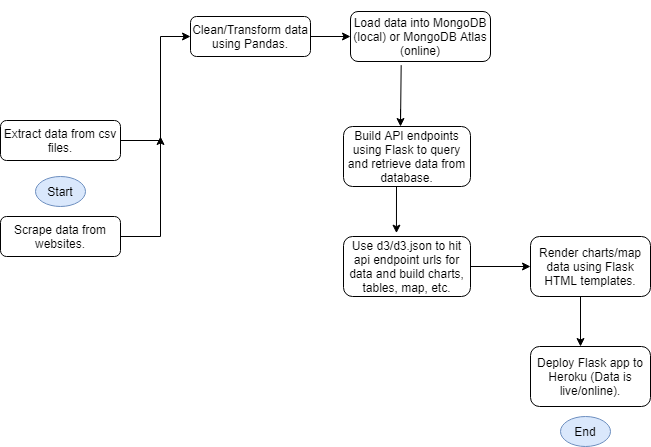

# About the data

## Data Flow

## Sources

- [Fires from Space: Australia](https://www.kaggle.com/carlosparadis/fires-from-space-australia-and-new-zeland) by Carlos Paradis.
- [List of 2019-2020 bushfires by state](https://en.wikipedia.org/wiki/List_of_fires_and_impacts_of_the_2019-20_Australian_bushfire_season) from Wikipedia.
- [List of Major Bushfires in Australia](https://en.wikipedia.org/wiki/List_of_major_bushfires_in_Australia) from Wikipedia.
- [2019 - 2020 Australian bushfire season](https://en.wikipedia.org/wiki/2019%E2%80%9320_Australian_bushfire_season) from Wikipedia.
- [GeoJSON-formatted Australian state and township border data](https://github.com/tonywr71/GeoJson-Data) by [tonywr71](https://github.com/tonywr71).
- [Australian Climate Data](http://www.bom.gov.au/climate/data/) from the Australian Government Bureau of Meteorology. 

## Original Datasets

A few of the original datasets are stored in this repository as zip files in the [Resources](./Resources) folder, for posterity. Other data was scraped from Wikipedia.

This repo uses Git LFS to store the large dataset files on GitHub. To install Git LFS, visit the [Git-LFS site](https://git-lfs.github.com/).

## Database Structure

The **australia_fire_db** currently has the following collections:

- **fires_modis** - Includes Australian fire observations detected by MODIS (Moderate Resolution Imaging Spectroradiometer) satellite sensors.

| Field       | Type
| :------------- | :----------: |
|  `_id` | ObjectId |
| `acq_date`   | String |
|  `acq_time` | Int |
| `bright_t31` | Double |
| `brightness` | Double |
| `daynight` | String |
| `frp` | Double |
| `instrument` | String |
| `latitude` | Double |
| `longitude` | Double |
| `satellite` | String |

- **fires_viirs** - Includes Australian fire observations detected by VIIRS (Visible Infrared Imaging Radiometer Suite) satellite sensors.

| Field       | Type
| :------------- | :----------: |
|  `_id` | ObjectId |
| `acq_date`   | String |
|  `acq_time` | Int |
| `bright_ti4` | Double |
| `bright_ti5` | Double |
| `frp` | Double |
| `instrument` | String |
| `latitude` | Double |
| `longitude` | Double |
| `satellite` | String |

- **historicalFires** - Includes information about past Australian fire seasons.

| Field       | Type
| :------------- | :----------: |
|  `_id` | ObjectId |
| `Date`   | String |
|  `Name` | String |
| `State(s)/territories` | String |
| `AreaBurned(ha)` | Int |
| `AreaBurned(acres)` | Int |
| `Fatalities` | Int |
| `PropertiesDamaged(HomesDestroyed)` | Int |
| `Year` | Int |

- **temp_rainfall** - Includes Australian average annual max temperature and rainfall observations from 1956-2019.

| Field       | Type
| :------------- | :----------: |
|  `_id` | ObjectId |
| `Year`   | Int |
|  `Avg Annual Temp` | Double|
| `Avg Annual Rainfall` | Double |
| `temp_differnce` | Double |
| `rainfall_difference` | Double |

- **bushfiresbyState** - Includes information about the 2019-2020 Australian bushfire season by state.

| Field       | Type
| :------------- | :----------: |
|  `_id` | ObjectId |
| `State/Territory`   | String |
|  `Fatalities` | Int |
| `Homeslost` | Int |
| `Areaestimated(ha)` | Int |
| `Areaestimated(acres)` | Int |

- **aus2019_2020** - Includes additional information about the 2019-2020 bushfire season.

| Field       | Type
| :------------- | :----------: |
|  `_id` | ObjectId |
| `Fire`   | String |
|  `Name` | String |
| `State` | String |
| `Local Government Area(s)` | String |
| `AreaImpacted(ha)` | Int |

- **fires_time_series** - Includes the number of fire observations captured by NASA satellites each day
during the 2019-20 Australia fire season. This collection is used to create the D3 time series chart for this project.

| Field       | Type
| :------------- | :----------: |
|  `_id` | ObjectId |
| `acq_date`   | String |
|  `number_fires` | Int |

